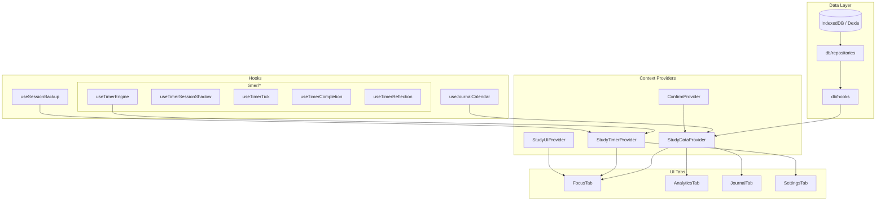
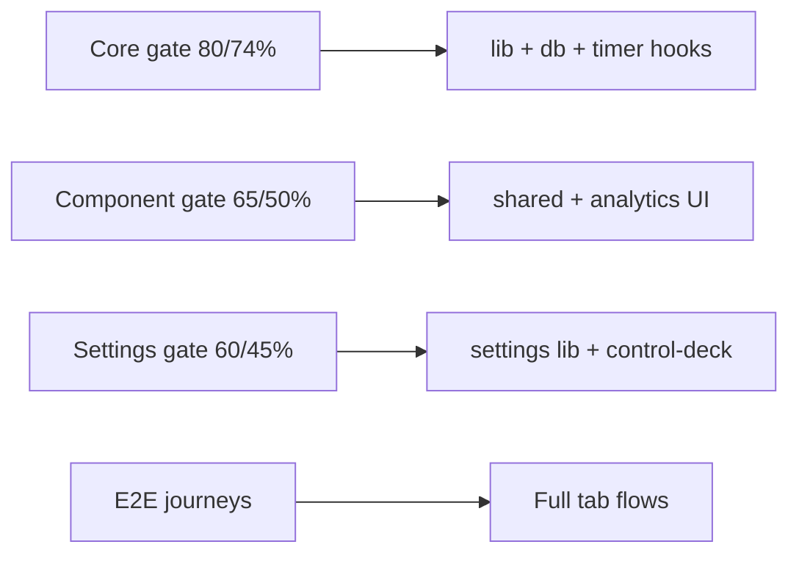
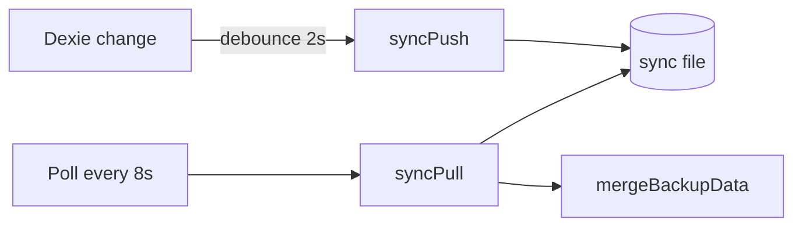

# Architecture

Local-first study dashboard: React 19 + Vite + Dexie (IndexedDB) + Tailwind v4.

## Context tree

## Testing pyramid

| Layer | Tool | Location |
|-------|------|----------|
| Unit | Vitest | `src/lib`, `src/db`, `src/hooks` |
| Component | Vitest + Testing Library | `src/components/**/__tests__` |
| Integration | Vitest + providers | `src/context/__tests__` |
| E2E | Playwright | `e2e/` |
| Visual / a11y | Storybook + addon-a11y | `src/**/*.stories.tsx` |

## Testing and coverage

Coverage is **gated by tier**, not universal across the entire UI. Full-app line coverage is intentionally not the goal — E2E and component tests cover integration paths; tier gates protect critical logic.

| Tier | Command | Thresholds | Scope |
|------|---------|------------|-------|
| Core | `npm run test:coverage` | 80% lines / 74% branches | `lib`, `db`, timer/backup hooks |
| Component | `npm run test:coverage:components` | 65% lines / 50% branches | Shared primitives and analytics UI |
| Settings | `npm run test:coverage:settings` | 60% lines / 45% branches | Control-deck panels and settings widgets |
| E2E | `npm run test:e2e` | Journey-based | Tab flows, settings, focus, backup |

## Data flow

- **Repositories** encapsulate Dexie CRUD (`src/db/repositories`).
- **Domain hooks** (`src/db/hooks`) expose live queries via `dexie-react-hooks`.
- **StudyDataProvider** aggregates settings, tasks, history, categories, notes.
- **StudyTimerProvider** owns timer engine, backup import/export, and task actions.
- **StudyUIProvider** owns tab routing, zen mode, toasts, and theme CSS variables.

Import hooks from `db/hooks` — not legacy shims.

## Layer rules

| Layer | May import |
|-------|------------|
| `db/repositories`, `db/hooks` | `db/db` (Dexie instance) |
| `hooks`, `components`, `lib` | `db/repositories`, `db/hooks`, `db/types` — **not** `db/db` |
| Tests | `db/db` allowed for setup/teardown |

ESLint enforces `no-restricted-imports` on `components`, `hooks`, and `lib`. Bulk backup/merge operations live in `db/repositories/database.ts`.

Tab-gated analytics/journal work uses `useLazyStudyFeatures(activeTab)` from `StudyDataProvider`.

Dexie schema version: **12** (`db.verno`).

## Folder sync

Bidirectional sync between web (Chrome/Edge File System Access) and Tauri desktop via a shared `study-vault.sync.studybackup` file:

- **Orchestrator:** `lib/sync/syncOrchestrator.ts` — adapter resolution, poll, push debounce, manual `syncNow`.
- **Adapters:** `fileSystemAccess.ts` (web), `desktopSyncAdapter.ts` (Tauri).
- **Settings UI:** `FolderSyncPanel` in Backup Vault; lifecycle via `useFolderSync` from `useAppShellEffects`.

## `lib/` layout

| Folder | Contents |
|--------|----------|
| `lib/backup/` | Vault export/import, checksum, crypto, merge |
| `lib/sync/` | Folder sync orchestrator, push/pull, adapters |
| `lib/export/` | ICS and weekly report export |
| `lib/theme/` | Theme profiles, CSS variables, fonts |
| `lib/desktop/` | Tauri bridge, native notifications, wake lock |
| `lib/audio/` | Ambient sound engine |
| `lib/routing/` | Hash routing, tab sync, prefetch, command palette search |
| `lib/settings/` | Settings validation and section registry |
| `lib/study/` | Study dashboard math, recurrence, timer helpers |
| `lib/shared/` | UX terms, constants, dev logger |

## PWA / offline

- Service worker precaches the app shell (`vite-plugin-pwa`).
- IndexedDB is the source of truth; no remote API.
- `AppShell` shows an offline banner when `navigator.onLine` is false.
