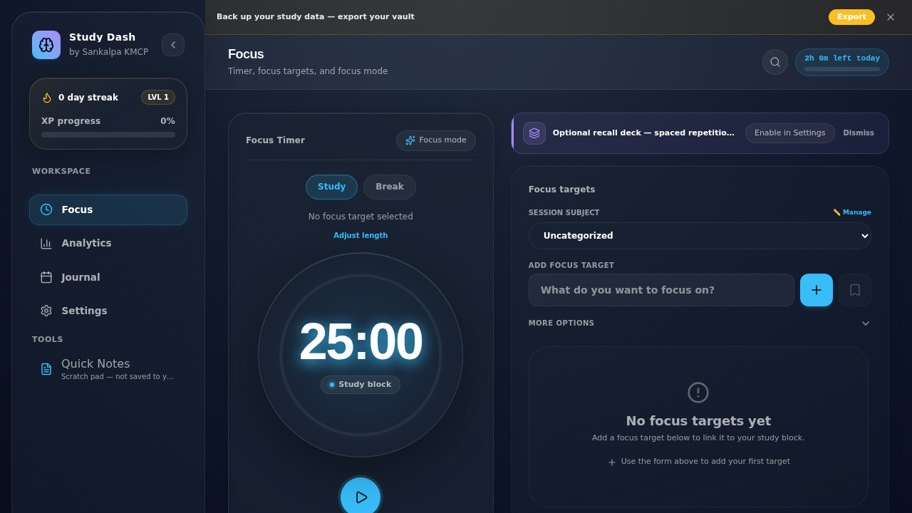
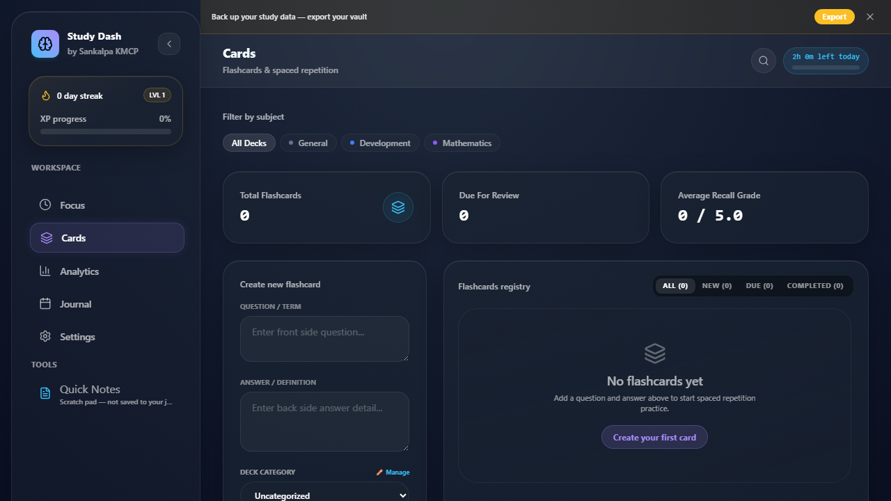
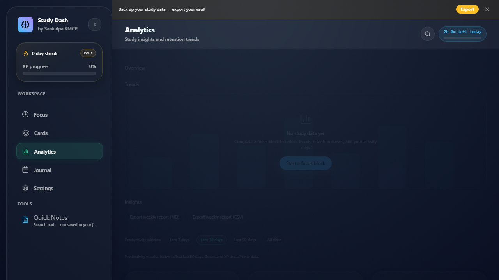
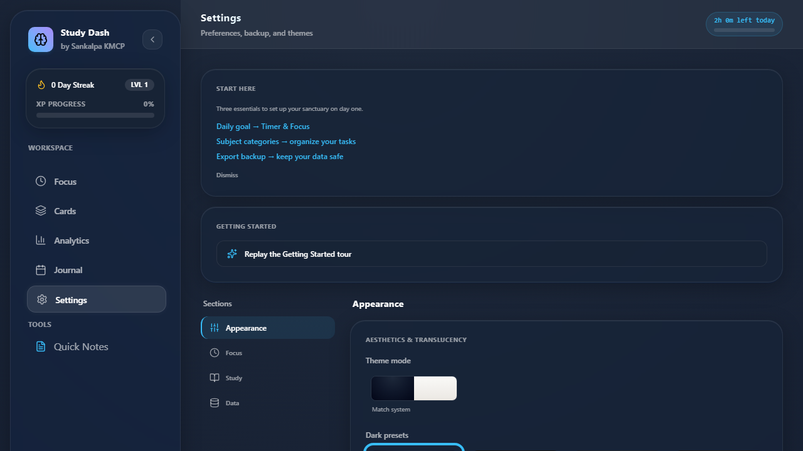

# Study Dashboard // The Cognitive Focus Console

A local-first, privacy-focused study dashboard with Pomodoro timing, task tracking, spaced repetition flashcards, analytics, and journaling.

**Created by Sankalpa KMCP**

[](https://github.com/SankalpaKMCP/StudyApp/deployments/github-pages)

## Screenshots

| Focus | Cards | Analytics | Settings |
|-------|-------|-----------|----------|
|  |  |  |  |

---

## Core Premise: Local-First & Offline

- **Zero Cloud Dependency:** All data stays in IndexedDB on your device.
- **Absolute Privacy:** No telemetry, tracking, or remote APIs.
- **Self-Contained:** Runs entirely in the browser or as a Tauri desktop app.

### Known limits

- **English-only UI** — no localization layer in this build.
- **Local-first** — no cloud sync; use `.studybackup` vault export/import for cross-device transfer.
- **Private license** — not open source (see [License](#license)).
- **Ambient soundscapes** — basic rain and white-noise presets during study blocks, not a full soundscape library.

---

## Features

### Refined glass UI
- Frosted panels with shared `Card`, `Button`, and `ModalShell` primitives
- Theme opacity and blur sliders in Control Deck affect all glass cards in real time
- Per-theme page gradients and consistent 11–12px minimum label typography

### Focus Engine
- Configurable study block, short break, and long break durations
- Pomodoro cycle tracking with optional zen lockout during study
- Session reflection with attention/stability ratings
- Interrupted session recovery via `sessionStorage` heartbeat
- Screen wake lock during active study blocks

### Task Registry
- Priority-sorted tasks with cycle estimates
- SM-2 spaced repetition for study subjects
- Subtasks and auto-archive of completed tasks (90+ days)

### Recall Deck
- Flashcards with SM-2 scheduling
- Category filters and grade tracking

### Analytics Studio
- Weekly charts, category breakdown, retention curves
- Configurable productivity window (7 / 30 / 90 days or all time)
- Streak and XP leveling from study minutes (all-time)

### Activity Ledger
- Calendar heatmap and daily mood/notes journal
- Per-day session history

### Control Deck
- Theme, opacity, blur, timer, sound, font, and backup settings
- Export/import `.studybackup` vault files, CSV reports, and ICS calendar
- Storage usage panel and optional history archival
- Web Share backup on supported mobile browsers

### Task & flashcard productivity
- Task templates saved from the focus task form
- Flashcard deck CSV import
- Virtual scrolling for large task and flashcard lists

---

## Audio

The app plays **short session chimes** when blocks complete (toggle in Settings). **Optional ambient loops** (rain or white noise) play during active study blocks only — independent of chimes and toggled in Sound & Feedback.

---

## Timer Settings

| Setting | Default | Description |
|---------|---------|-------------|
| `dailyGoalMinutes` | 120 | Daily study target |
| `studyBlockDurationMinutes` | 25 | Focus block length |
| `shortBreakDurationMinutes` | 5 | Short break length |
| `longBreakDurationMinutes` | 15 | Long break length |
| `targetSessionsPerCycle` | 4 | Study sessions before long break |
| `historyRetentionDays` | 0 | Auto-archive threshold (0 = keep all; manual sweep in Backup Vault) |
| Backup reminder interval | 30 days | Reminds when no export; dismiss snoozes 7 days |

---

## Data Model

- **History entries** include `createdAt` (epoch ms) for reliable date filtering, plus a human-readable `timestamp` for display.
- **Emergency snapshots** are stored in IndexedDB (`snapshots` table), keeping the last 3 automatic backups.
- **Schema version:** 7 (Dexie `db.verno` — IndexedDB migration version).
- **Backup `version: 2`** in `.studybackup` JSON exports is the **export file format** revision — separate from the DB schema version above.
- See [CHANGELOG.md](CHANGELOG.md) for release notes.

### Data limits

| Limit | Value | Used by |
|-------|-------|---------|
| Recent history window | 100 entries (configurable 50–500) | Timer settings (`recentHistoryLimit`) |
| Analytics productivity window | 7d / 30d / 90d / all (default 30d) | Analytics insights (`useAnalyticsHistoryRange`) |
| Journal history | Current calendar month | `useHistoryForMonth` |
| Full history table | Unbounded | Backup export only (`db.history.toArray`) |
| Auto snapshots retained | 3 | `useSessionBackup` |
| Shadow restore threshold | ≥ 60s elapsed | `useTimerEngine` sessionStorage heartbeat |
| Reflection notes max | 500 chars | Activity ledger / reflection modal |

---

## Architecture

Data hooks live in [`src/db/hooks/`](src/db/hooks/) (repositories + per-domain hooks). Full diagrams and context tree: [ARCHITECTURE.md](ARCHITECTURE.md).

## Development

The git repository root is the `web/` folder. If your editor workspace is the parent `study app` directory, you can run scripts from there via the root delegate `package.json` (`npm run dev` → `npm --prefix web run dev`).

```bash
npm ci
npm run dev
npm run build
npm test
npm run test:coverage
npm run test:coverage:components
npm run test:coverage:settings
npm run check:bundle
npm run test:watch
npm run test:e2e
npm run storybook
npm run build-storybook
npm run test:storybook
npm run lint
```

`npm run dev` serves the app at http://localhost:5173. On Windows, run commands without trailing `#` comments — CMD does not treat `#` as a comment and will pass those words to Vite as extra args.

See [CONTRIBUTING.md](CONTRIBUTING.md) for migrations, settings, and E2E conventions.

### Testing guide

| Layer | Command | Location |
|-------|---------|----------|
| Unit / hooks | `npm test` | `src/lib/__tests__`, `src/db/__tests__`, `src/hooks/__tests__` |
| Component | `npm test` | `src/components/**/__tests__` |
| Context / integration | `npm test` | `src/context/__tests__` |
| Coverage gate | `npm run test:coverage` | 80% lines / 74% branches on scoped modules |
| Component gate | `npm run test:coverage:components` | 65% lines / 50% branches on shared primitives and analytics |
| Settings gate | `npm run test:coverage:settings` | 60% lines / 45% branches on control-deck and settings widgets |
| E2E | `npm run test:e2e` | `e2e/` including analytics, journal, zen, mobile, invalid backup |
| Storybook + a11y | `npm run storybook` | `@storybook/addon-a11y` on all stories |

### Tauri Desktop App

```bash
npm run tauri:dev    # Desktop dev with hot reload
npm run tauri:build  # Build native installer
```

Push a version tag (`v*`, e.g. `v1.0.0`) to trigger the Tauri release build workflow (`.github/workflows/tauri-release.yml`).

---

## PWA Install

The app includes a web manifest and service worker (`vite-plugin-pwa`) for offline app-shell caching. The service worker precaches the app shell; IndexedDB is the source of truth (no remote API). An offline banner appears when the network is unavailable. Deploy to GitHub Pages or any static host.

---

## Deployment (GitHub Pages)

Pushes to `master` or `V2` trigger automatic deployment via `.github/workflows/deploy-pages.yml`.

Base path: `/StudyApp/` (configured in `vite.config.ts`).

**One-time repo setup (required):** In GitHub → Settings → Pages → Build and deployment, set **Source** to **GitHub Actions** (not “Deploy from a branch”). Without this, `deploy-pages` fails with `401 Requires authentication`.

**Actions permissions:** Settings → Actions → General → Workflow permissions → **Read and write permissions**.

---

## License

Private project by Sankalpa KMCP.
